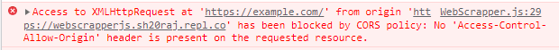

# WebScrapperJS
WebScrapperJS - Get Content/HTML of any website without being blocked by CORS even using JavaScript by WhollyAPI 

---
<center>
Website :- <a href="https://sh20raj.github.io/WebScrapperJS/"> https://sh20raj.github.io/WebScrapperJS/ </a> 

---
<a href="https://github.com/SH20RAJ/WebScrapperJS/">GitHub</a>  | <a href="https://replit.com/@SH20RAJ/WebScrapperJS/">Repl.it</a> | <a href="https://dev.to/sh20raj/webscrapperjs-get-contenthtml-of-any-website-without-being-blocked-by-cors-even-using-javascript-by-whollyapi-42l7">Dev.to Article</a>

</center>

---

## Grab the CDN or Download the JavaScript File

```html
<script src="https://cdn.jsdelivr.net/gh/SH20RAJ/WebScrapperJS/WebScrapper.js" ></script>
```
---

- **`WebScrapper.get()`** will return you the content of the provided url in a String. 

- **`WebScrapper.gethtml()`** will return you the content of the provided url as Parsed DOM. ( Will get the html and Parse it as a DOM object . Will return you a #Document)

- **`WebScrapper.getjson()`** will return you the content of the provided url as Parsed JSON.

---

### To Get HTML/Text/Content of Any Website in a String.

```javascript
var html = WebScrapper.get('https://webscrapperjs.sh20raj.repl.co/');//This will be return the HTML/Text inside the webpage in a String.
console.log(html);
```
This will be return the HTML/Text inside the webpage in a String.

<a href="https://jsfiddle.net/sh20raj/sbxjfv0c/">Try this</a>

---


### To Get HTML Content of Any Website in DOM Parsed Form `WebScrapper.gethtml()` 
```javascript
var url = 'https://google.com/';
var html = WebScrapper.gethtml(url);//html of the url will be Parsed and stored in this variable
console.log(html);
console.log(html.title);//As you Use document.title you can Use Like this to get the title.
```

---

### Intialise own WebScrapper with URL `new scrapper()`
```javascript
let MyWebScrapper = new scrapper('https://example.com/');
//You can now directly call gethtml() instead of passing a url into it.

console.log(MyWebScrapper.gethtml()); //Grab https://example.com/ and print on console

```

Still you can Use new created scrapper `MyWebScrapper` for grabbing new URLs. Like

```javascript
let MyWebScrapper = new scrapper('https://example.com/');
//You can now directly call gethtml() instead of passing a url into it.

console.log(MyWebScrapper.gethtml()); //Grab https://example.com/ and print on console

console.log(MyWebScrapper.gethtml('https://example.com/')); //Grab https://youtube.com/ and print on console

```

---
### You can also fetch JSON Using WebScrapperJS 
```javascript
var json = WebScrapper.getjson('https://jsonplaceholder.typicode.com/todos/1');//Return result direct in json format
console.log(json);
```
<a href="https://jsfiddle.net/sh20raj/voty4xpr/">Try This</a>

---
## Getting Result more Faster

**Use the Below codes/methods only if the origin or feching URL is not blocked by CORS Like this**



if your origin is not blocking you then you must use the below fetch() code instead of gethtml() directly.
because it returns the results faster without using API.It will directly fetch origin using AJAX.

### Use `WebScrapper.fetch()`  to get the html/text in a string

We will use this url `https://webscrapperjs.sh20raj.repl.co/` because it is not blocked.

```javascript
var html = WebScrapper.fetch('https://webscrapperjs.sh20raj.repl.co/');//This will be return the HTML/Text inside the webpage a string.
console.log(html);
```
This will be return the HTML/Text inside the webpage in a String.

<a href="https://jsfiddle.net/sh20raj/sbxjfv0c/">Try this</a>

---

### Use `WebScrapper.fetchhtml()`  to get the Parsed HTML/DOM document as `WebScrapper.gethtml()`.

```javascript
var html = WebScrapper.fetchhtml('https://webscrapperjs.sh20raj.repl.co/');//This will be return the Parsed HTML inside the webpage. 
console.log(html);
console.log(html.title);
```
<a href="https://jsfiddle.net/sh20raj/8fc2u1nj/">Try this</a>

---

### Use `WebScrapper.fetchjson()`  to get the Parsed JSON

```javascript
var json = WebScrapper.fetchjson('https://webscrapperjs.sh20raj.repl.co/sample.json');//This will be return the JSON inside the webpage. 
console.log(json);
console.log(json.id);
```
<a href="https://jsfiddle.net/sh20raj/okuLswtg/">Try this</a>

---

### Try this on Codepen

Sample Code | Codepen :- <a href="https://codepen.io/SH20RAJ/pen/VwrwjXJ?editors=1001">https://codepen.io/SH20RAJ/pen/VwrwjXJ?editors=1001</a>

```html
<div id="scrappedcontent"></div>

<script src="https://cdn.jsdelivr.net/gh/SH20RAJ/WebScrapperJS/WebScrapper.min.js" ></script> 
<script>
  let MyWebScrapper = new scrapper('https://google.com/');
//You can now directly call gethtml() instead of passing a url into it.

console.log(MyWebScrapper.gethtml()); //Grab https://example.com/ and print on console
var html = MyWebScrapper.gethtml('https://example.com/');
  
console.log(html); //Grab https://youtube.com/ and print on console
  
document.getElementById('scrappedcontent').innerHTML = html;
</script>
```

See Results <a href="https://codepen.io/SH20RAJ/pen/VwrwjXJ?editors=1001">Here</a> 

---

# Other Features

## `WebScrapper.getparam()` get URL Parameters

Assuming your Current URL is `https://example.com/?id=7`.
```javascript
let id = WebScrapper.getparam('id');
console.log(id);//Will Return "7" .

```

### Use Custom string instead of current URL

```javascript
let id = WebScrapper.getparam('id','https://example.com/?id=20');
console.log(id);//Will Return "20" .

```

## `WebScrapper.getRandomInt()` get random integer in range

This function take 2 parameter `WebScrapper.getRandomInt(min,max)` the generated number will be in between min and max.
```javascript
let id = WebScrapper.getRandomInt(10,100);
console.log(id);//Will Return a number between 10 and 100 .

```
